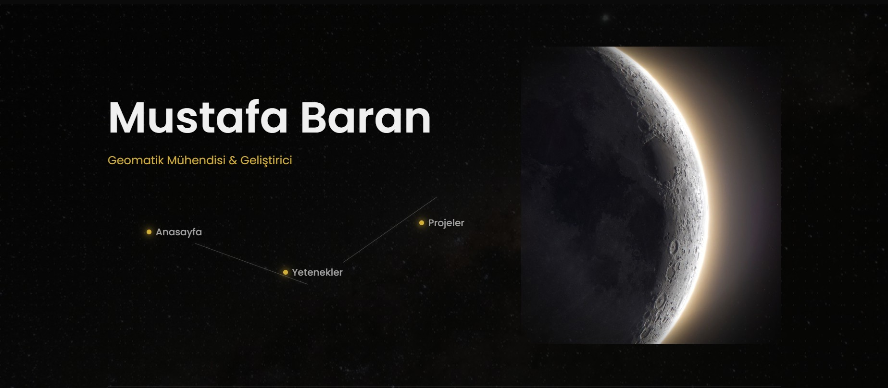
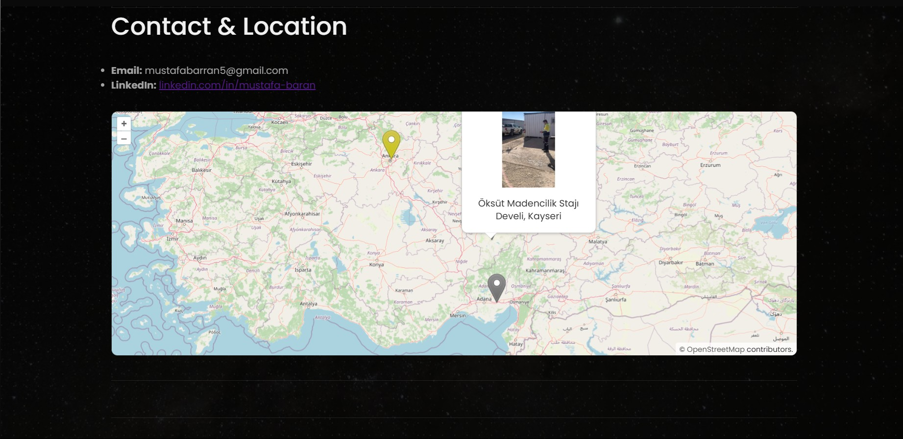
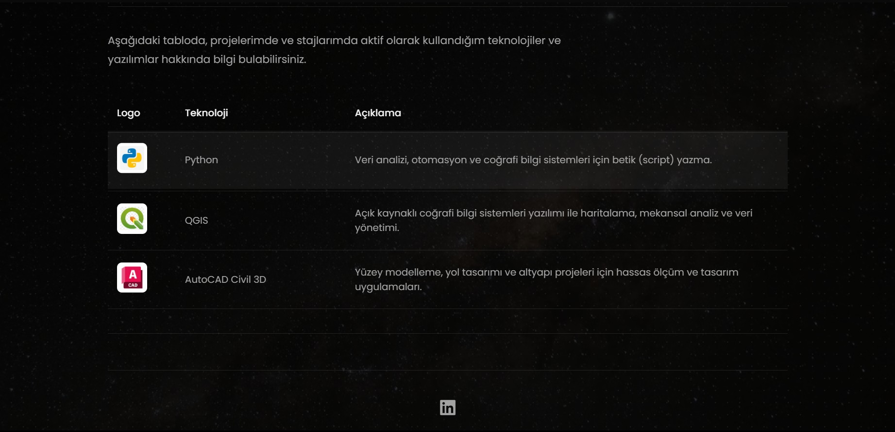

# GMT 458 - Personal Web Portfolio: Mustafa Baran

This project is a personal portfolio website developed as part of the GMT 458 Web GIS course at Hacettepe University. Built using HTML, CSS, and JavaScript, it features interactive map functionalities via OpenLayers and boasts a modern aesthetic guided by contemporary web design principles.

**Live Demo:** [View the Live Site](https://mustafabtw.github.io/personal_web_page_webgis_mustafa_baran/) 

---

## Project Preview

---

## Core Features

* **Modern & Futuristic Design:** A minimalist and sleek interface built on a dark theme using the Poppins font, accented with a gold color (`#D4AF37`).
* **Asymmetric Hero Section (Homepage):** An engaging landing view featuring text, navigation, and a profile picture on the left, complemented by a vertically oriented Moon image with softened edges on the right.
* **Constellation Navigation:** Links for page navigation are designed as a thematic constellation, with glowing stars connected by lines, instead of a static menu.
* **Multi-Page Structure:** The site comprises three main sections: "Home," "Skills," and "Projects."
* **Interactive OpenLayers Map:** The homepage features a map centered on Turkey, displaying the user's personal location (Ankara) and internship locations (Kayseri, Adana) with custom icons on an OpenStreetMap base layer.
    * **Illustrated Pop-ups:** Clicking on internship icons opens informative pop-up windows containing relevant photos and details. Images are fitted (`object-fit: contain`) within the pop-up without cropping.
* **Skills Table with Images:** The "Skills" page lists used technologies (Python, QGIS, AutoCAD Civil 3D) along with their respective logos in a structured table.
* **Project Cards with Logos:** The "Projects" page showcases the graduation project and internship experiences within modern cards, each featuring the logo of the corresponding institution (Hacettepe, Öksüt, SNH).
* **Scroll Animations:** Content sections (`section`) gently fade and slide into view as the user scrolls down the page, implemented using the `IntersectionObserver` API.
* **Micro-interactions:** Hover effects are added to navigation links, table rows, and project cards to enhance user interaction and provide visual feedback.
* **Enhanced Footer:** Includes a social media icon linking to the user's LinkedIn profile.
* **Custom Favicon:** A custom icon represents the site in browser tabs.

---

## Technologies Used

* **HTML5:** Structure and content of the web pages.
* **CSS3:** Styling, layout, animations, and modern aesthetics (Flexbox, CSS Variables, Masking, `object-fit`).
* **JavaScript (Vanilla JS):** Scroll animations (`IntersectionObserver`) and dynamic functionalities of the OpenLayers map (adding features, pop-up management).
* **OpenLayers:** Creation and management of the interactive map.
* **Google Fonts (Poppins):** Modern and readable typography.
* **FontAwesome:** Social media icons.
* **Git & GitHub:** Version control and project hosting.
* **GitHub Pages:** Live deployment of the website.

---

## Artificial Intelligence (AI) Usage Report

During the development of this project, support was sought from an Artificial Intelligence (AI) coding assistant to overcome challenges and learn modern web techniques. While the fundamental HTML/CSS structure and content placement were handled independently, the AI primarily served as a "tutor" for the following specific and advanced topics:

* **Key Concepts Learned from AI:**
    * **Scroll Animations:** Utilizing the `IntersectionObserver` API with JavaScript to make content sections appear smoothly upon scrolling.
    * **Interactive Map Enhancements:** Understanding the logic behind adding custom icons and **pop-up windows containing both text and images** to a standard OpenLayers map.
    * **Advanced CSS Techniques:** Implementing `mask-image` to blend image edges softly into the background (vignette effect) and using `object-fit` for proper image scaling within containers. Conceptualizing and implementing the constellation navigation using `position: absolute` and pseudo-elements (`::before`, `::after`).
* **Processes Reminded or Expedited:**
    * Reminders on using CSS Flexbox for creating and aligning complex layouts more quickly.
* **Estimated AI Usage Time:**
    * Throughout this project, the AI assistant was consulted for approximately 1 hour, particularly for learning and implementing the advanced topics mentioned above.

---