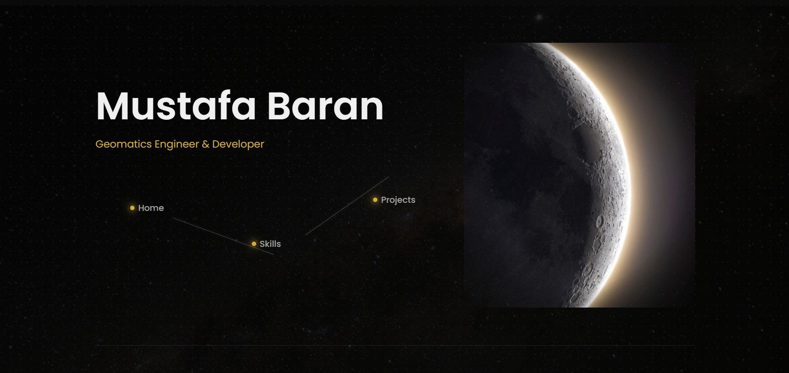

# GMT 458 - Kişisel Web Portfolyo Sayfası: Mustafa Baran

Bu proje, Hacettepe Üniversitesi GMT 458 Web GIS dersi kapsamında geliştirilmiş kişisel bir portfolyo web sitesidir. HTML, CSS ve JavaScript kullanılarak oluşturulmuş, OpenLayers ile interaktif harita özellikleri eklenmiş ve modern web tasarım prensipleriyle estetik bir görünüm kazandırılmıştır.

**Canlı Demo:** [Sitenin Canlı Halini Görüntüle](https://mustafabtw.github.io/personal_web_page_webgis_mustafa_baran/) 

---

## Proje Görünümü

**Örnek Ekran Görüntüleri:**

---

## Temel Özellikler

* **Modern & Fütüristik Tasarım:** Karanlık tema üzerine kurulu, Poppins fontu kullanılarak hazırlanmış, altın rengi (`#D4AF37`) vurgulara sahip minimalist ve şık bir arayüz.
* **Asimetrik Hero Bölümü (Anasayfa):** Sol tarafta metin ve navigasyon, sağ tarafta ise kenarları yumuşatılmış dikey bir Ay görseli bulunan etkileyici bir karşılama ekranı.
* **Takım Yıldızı Navigasyonu:** Sayfalar arası geçişi sağlayan linkler, statik bir menü yerine, parlayan yıldızlar ve onları birleştiren çizgilerden oluşan tematik bir takım yıldızı şeklinde tasarlanmıştır.
* **Çok Sayfalı Yapı:** Site, "Anasayfa", "Yetenekler" ve "Projeler" olmak üzere üç ana bölümden oluşmaktadır.
* **İnteraktif OpenLayers Haritası:** Anasayfada yer alan harita, OpenStreetMap altlığı üzerinde benim kişisel konumunu (Ankara) ve staj yaptığım yerleri (Kayseri, Adana) özel ikonlarla göstermektedir.
    * **Resimli Pop-up'lar:** Staj yeri ikonlarına tıklandığında, ilgili yerin fotoğrafını ve bilgisini içeren bilgilendirme pencereleri açılır. Görseller, popup içine kırpılmadan sığdırılmıştır.
* **Resimli Yetenekler Tablosu:** "Yetenekler" sayfasında, kullanılan teknolojiler (Python, QGIS, AutoCAD Civil 3D) logolarıyla birlikte listelenmiştir.
* **Logolu Proje Kartları:** "Projeler" sayfasında, bitirme projesi ve staj deneyimleri, ilgili kurumların logolarıyla birlikte (Hacettepe, Öksüt, SNH) modern kartlar içinde sunulmuştur.
* **Kaydırma Animasyonları:** Sayfa aşağı kaydırıldıkça içerik bölümlerinin (`section`) yumuşak bir animasyonla ekrana gelmesi sağlanmıştır.
* **Mikro-Etkileşimler:** Navigasyon linkleri, tablo satırları ve proje kartları gibi elementlere, kullanıcı etkileşimini artıran hover (üzerine gelme) efektleri eklenmiştir.
* **Geliştirilmiş Footer:** Sayfa altında LinkedIn profilime yönlendiren bir sosyal medya ikonu bulunmaktadır.
* **Özel Favicon:** Tarayıcı sekmesinde siteyi temsil eden özel bir ikon kullanılmıştır.

---

## Kullanılan Teknolojiler

* **HTML5:** Sayfa yapısı ve içeriği.
* **CSS3:** Tasarım, yerleşim, animasyonlar ve modern estetik (Flexbox, CSS Değişkenleri, Maskeleme, `object-fit`).
* **JavaScript (Vanilla JS):** Kaydırma animasyonları (`IntersectionObserver`) ve OpenLayers haritasının dinamik işlevleri (ikon ekleme, pop-up yönetimi).
* **OpenLayers:** İnteraktif harita oluşturma ve yönetimi.
* **Google Fonts (Poppins):** Modern ve okunaklı yazı tipi.
* **FontAwesome:** Sosyal medya ikonları.
* **Git & GitHub:** Versiyon kontrolü ve projenin barındırılması.
* **GitHub Pages:** Projenin canlı olarak yayınlanması.

---

## Yapay Zeka (AI) Kullanım Raporu

Bu projenin geliştirilmesi sırasında, karşılaşılan zorlukları aşmak ve modern web tekniklerini öğrenmek amacıyla Yapay Zeka (AI) kodlama asistanından destek alındı. Temel HTML/CSS yapısı ve içerik yerleşimi tarafımca yapılmış olup, AI daha çok aşağıdaki spesifik ve ileri seviye konularda bir "eğitmen" rolü üstlenmiştir:

* **Öğrenilen Kilit Konular:**
    * Kaydırma Animasyonları (`IntersectionObserver` API).
    * İnteraktif Harita Geliştirmeleri (Özel ikonlar, **resimli pop-up'lar**).
    * İleri Düzey CSS Teknikleri (`mask-image`, `object-fit`, takım yıldızı navigasyonu).
* **Hatırlatılan veya Hızlandırılan Süreçler:**
    * CSS Flexbox kullanımı.
    * Basit kodlama hatalarının (dosya yolları, etiket kapatma) tespiti.
* **Tahmini AI Kullanım Süresi:**
    * Bu projede, özellikle yukarıda belirtilen ileri seviye konuların öğrenilmesi ve uygulanması için yaklaşık olarak 1 saat boyunca Yapay Zeka asistanı ile birlikte çalışılmıştır.

---